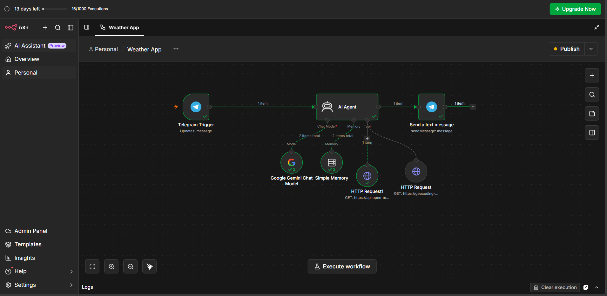

# 🌦️ Weather Update Agent

An AI-powered weather assistant built with **n8n**, **Google Gemini**, **Open-Meteo**, and **Telegram**.

The agent lets users request weather information naturally through Telegram. It identifies the requested location, retrieves coordinates, fetches current weather and a 7-day forecast, uses Gemini to interpret the data, and sends a concise response back to Telegram.

## ✨ Features

- 💬 Natural-language weather requests through Telegram
- 📍 Automatic location detection and geocoding
- 🌡️ Current temperature and feels-like temperature
- 💧 Humidity information
- 🌧️ Precipitation data
- 💨 Wind speed
- ☁️ Human-readable weather conditions
- 📅 7-day weather forecast data
- 🧠 Conversation memory for each Telegram chat
- 🤖 AI-generated concise weather responses
- ⚡ Fully automated n8n workflow

## 🏗️ Workflow Architecture

```text
Telegram User
     │
     ▼
Telegram Trigger
     │
     ▼
AI Agent ───────────────► Google Gemini Chat Model
     │
     ├──────────────────► Simple Memory
     │
     ├──────────────────► Open-Meteo Geocoding Tool
     │
     └──────────────────► Open-Meteo Weather Tool
     │
     ▼
Telegram Send Message
     │
     ▼
Telegram User
```

## 📸 Workflow




## 🧰 Tech Stack

| Technology | Purpose |
|---|---|
| **n8n** | Workflow automation and agent orchestration |
| **Google Gemini** | Natural-language understanding and response generation |
| **Open-Meteo Geocoding API** | Converts city/location names into coordinates |
| **Open-Meteo Forecast API** | Provides current weather and forecast data |
| **Telegram Bot API** | User interface and message delivery |
| **n8n Simple Memory** | Maintains conversation context per Telegram chat |

## 🔄 How It Works

### 1. Telegram Trigger

The workflow starts whenever a user sends a message to the Telegram bot.

Example:

```text
Weather in Kolhapur
```

### 2. AI Agent

The Gemini-powered AI Agent interprets the user's request and determines what weather information is needed.

It can understand requests such as:

```text
Weather in Kolhapur
What's the weather in Mumbai?
What about tomorrow?
Will it rain in Pune?
```

### 3. Location Search

The agent uses the Open-Meteo Geocoding API to find the latitude and longitude of the requested location.

### 4. Weather API

The coordinates are passed to the Open-Meteo Forecast API.

The workflow requests:

- Current temperature
- Relative humidity
- Apparent temperature
- Precipitation
- Weather code
- Wind speed
- Daily maximum/minimum temperatures
- Precipitation probability
- Daily precipitation
- Maximum wind speed

The workflow retrieves a 7-day forecast.

### 5. AI Response

Gemini converts the raw weather data into a concise, human-readable response.

The agent is instructed not to invent weather information and to explain weather codes in simple language when relevant.

### 6. Telegram Response

The generated response is sent back to the same Telegram chat.

## 🧠 Conversation Memory

The workflow uses n8n Simple Memory with the Telegram chat ID as the session key.

This allows the agent to maintain context within a conversation.

For example:

```text
User: Weather in Kolhapur

Bot: Current weather in Kolhapur...

User: What about tomorrow?

Bot: Tomorrow in Kolhapur...
```

Each Telegram chat gets its own memory session.

## 📁 Project Structure

```text
weather-update-agent-n8n/
│
├── README.md
│
├── workflow/
│   └── weather_update_agent.json
│
└── assets/
    └── workflow.png
```

## ⚙️ Setup

### Prerequisites

You need:

- An n8n instance
- A Telegram bot
- A Google Gemini API key
- Internet access for Open-Meteo APIs

### 1. Create the Telegram Bot

Create a bot using Telegram's BotFather and obtain the bot token.

Add the Telegram credentials to n8n.

### 2. Configure Google Gemini

Create a Gemini API key and add it to the Google Gemini credentials in n8n.

The workflow uses the Gemini Flash model configured in the exported workflow.

### 3. Import the Workflow

1. Open n8n.
2. Import `workflow/weather_update_agent.json`.
3. Configure your own Telegram and Gemini credentials.
4. Verify the node connections.
5. Activate/publish the workflow.
6. Open your Telegram bot and send a weather request.

> **Security:** Never commit API keys, Telegram bot tokens, passwords, or other credentials to GitHub.

## 💬 Example Requests

```text
Weather in Kolhapur
```

```text
What's the weather in Mumbai?
```

```text
Will it rain in Pune?
```

```text
What is the weather today in Delhi?
```

```text
What about tomorrow?
```

## 📊 Example Response

```text
Current Weather in Kolhapur, India

- Temperature: 22.7°C (feels like 25.6°C)
- Condition: Overcast
- Humidity: 92%
- Wind Speed: 11.2 km/h
- Precipitation: 0 mm
```

## 🔐 Security

The public repository should contain **no real credentials**.

When exporting or sharing the n8n workflow:

- Remove API keys
- Remove bot tokens
- Use your own n8n credentials after importing
- Never commit `.env` files containing secrets

## ⚠️ Limitations

- Weather accuracy depends on the Open-Meteo data source.
- Forecast availability depends on the API response and forecast range.
- Simple Memory is suitable for this project but is not a persistent production-grade memory solution for a scaled deployment.
- The Telegram bot requires the n8n workflow to be active/published.

## 🚀 Future Improvements

Possible extensions include:

- 🌧️ Rain alerts
- 📅 More advanced forecast queries
- 📍 User default locations
- 🌡️ Temperature alerts
- ⏰ Scheduled weather notifications
- 📊 Weather history and analytics
- 🗄️ Persistent database-backed memory
- 🐳 Self-hosted n8n with Docker
- 📈 Monitoring and error handling

## 🎯 Project Goal

This project demonstrates how **AI agents, APIs, automation workflows, conversational memory, and messaging platforms** can be combined into a practical automation system.

It was built as a hands-on project to demonstrate:

- AI Agent workflows
- API integration
- Workflow automation
- Prompt engineering
- Conversational memory
- Telegram bot integration
- Real-time data retrieval

## 📄 License

This project is available for educational and portfolio purposes.
